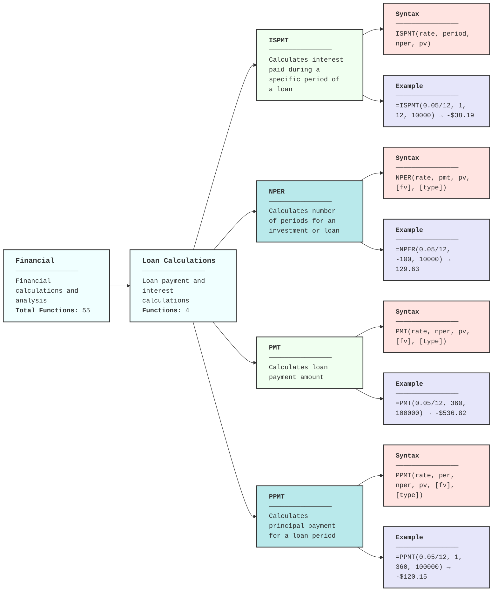

# Financial Loan Functions

```mermaid

graph LR
    Financial["<div align='left' style='font-family: MonoLisa, monospace;'><b style='font-size: 1.1em;'>Financial</b><br/>────────────────<br/>Financial calculations and analysis<br/><b>Total Functions:</b> 55</div>"]

    Financial --> LoanCalc["<div align='left' style='font-family: MonoLisa, monospace;'><b style='font-size: 1.1em;'>Loan Calculations</b><br/>────────────────<br/>Loan payment and interest calculations<br/><b>Functions:</b> 4</div>"]

    %% Loan Calculations (4 functions)
    %% ISPMT: Function 1
    LoanCalc --> ISPMT["<div align='left' style='font-family: MonoLisa, monospace;'><b>ISPMT</b><br/>────────────────<br/>Calculates interest paid during a specific period of a loan</div>"]
    ISPMT --> ISPMTSYNTAX["<div align='left' style='font-family: MonoLisa, monospace;'><b>Syntax</b><br/>────────────────<br/>ISPMT(rate, period, nper, pv)</div>"]
    ISPMT --> ISPMTEXAMPLE["<div align='left' style='font-family: MonoLisa, monospace;'><b>Example</b><br/>────────────────<br/>=ISPMT(0.05/12, 1, 12, 10000) → -$38.19</div>"]

    %% NPER: Function 2
    LoanCalc --> NPER["<div align='left' style='font-family: MonoLisa, monospace;'><b>NPER</b><br/>────────────────<br/>Calculates number of periods for an investment or loan</div>"]
    NPER --> NPERSYNTAX["<div align='left' style='font-family: MonoLisa, monospace;'><b>Syntax</b><br/>────────────────<br/>NPER(rate, pmt, pv, [fv], [type])</div>"]
    NPER --> NPEREXAMPLE["<div align='left' style='font-family: MonoLisa, monospace;'><b>Example</b><br/>────────────────<br/>=NPER(0.05/12, -100, 10000) → 129.63</div>"]

    %% PMT: Function 3
    LoanCalc --> PMT["<div align='left' style='font-family: MonoLisa, monospace;'><b>PMT</b><br/>────────────────<br/>Calculates loan payment amount</div>"]
    PMT --> PMTSYNTAX["<div align='left' style='font-family: MonoLisa, monospace;'><b>Syntax</b><br/>────────────────<br/>PMT(rate, nper, pv, [fv], [type])</div>"]
    PMT --> PMTEXAMPLE["<div align='left' style='font-family: MonoLisa, monospace;'><b>Example</b><br/>────────────────<br/>=PMT(0.05/12, 360, 100000) → -$536.82</div>"]

    %% PPMT: Function 4
    LoanCalc --> PPMT["<div align='left' style='font-family: MonoLisa, monospace;'><b>PPMT</b><br/>────────────────<br/>Calculates principal payment for a loan period</div>"]
    PPMT --> PPMTSYNTAX["<div align='left' style='font-family: MonoLisa, monospace;'><b>Syntax</b><br/>────────────────<br/>PPMT(rate, per, nper, pv, [fv], [type])</div>"]
    PPMT --> PPMTEXAMPLE["<div align='left' style='font-family: MonoLisa, monospace;'><b>Example</b><br/>────────────────<br/>=PPMT(0.05/12, 1, 360, 100000) → -$120.15</div>"]

    %% Styling
    style Financial fill:#F0FFFF,stroke:#333,stroke-width:2px
    style LoanCalc fill:#F0FFFF,stroke:#333,stroke-width:2px
    %% Functions alternate colors
    style ISPMT fill:#F0FFF0,stroke:#333,stroke-width:2px
    style NPER fill:#B9E9EB,stroke:#333,stroke-width:2px
    style PMT fill:#F0FFF0,stroke:#333,stroke-width:2px
    style PPMT fill:#B9E9EB,stroke:#333,stroke-width:2px
    %% All syntax nodes: pink
    style ISPMTSYNTAX fill:#FFE4E1,stroke:#333,stroke-width:2px
    style NPERSYNTAX fill:#FFE4E1,stroke:#333,stroke-width:2px
    style PMTSYNTAX fill:#FFE4E1,stroke:#333,stroke-width:2px
    style PPMTSYNTAX fill:#FFE4E1,stroke:#333,stroke-width:2px
    %% All example nodes: lavender
    style ISPMTEXAMPLE fill:#E6E6FA,stroke:#333,stroke-width:2px
    style NPEREXAMPLE fill:#E6E6FA,stroke:#333,stroke-width:2px
    style PMTEXAMPLE fill:#E6E6FA,stroke:#333,stroke-width:2px
    style PPMTEXAMPLE fill:#E6E6FA,stroke:#333,stroke-width:2px


```
