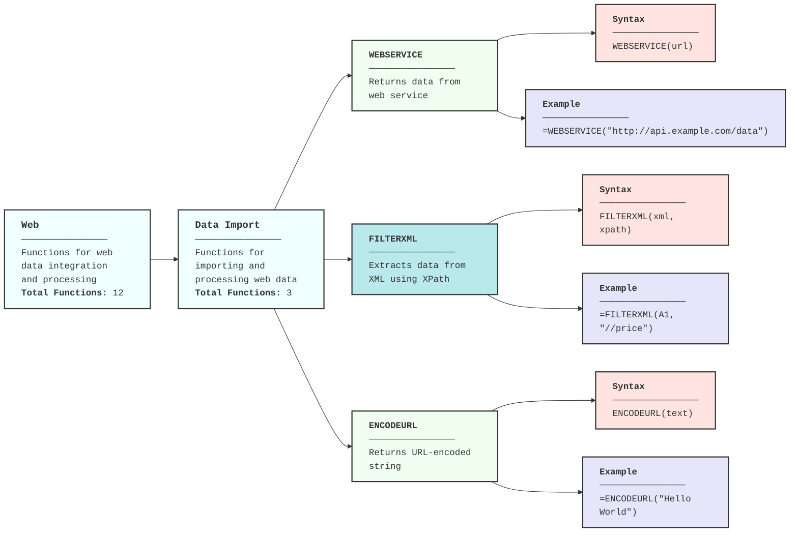

# Web Functions

This diagram shows 3 of the 12 Web functions. The IMPORT functions are not shown.

```mermaid

graph LR
    A["<div align='left' style='font-family: MonoLisa, monospace;'><b style='font-size: 1.1em;'>Web</b><br/>────────────────<br/>Functions for web data integration and processing<br/><b>Total Functions:</b> 12</div>"] --> B["<div align='left' style='font-family: MonoLisa, monospace;'><b style='font-size: 1.1em;'>Data Import</b><br/>────────────────<br/>Functions for importing and processing web data<br/><b>Total Functions:</b> 3</div>"]
    
    B --> WEBSERVICE["<div align='left' style='font-family: MonoLisa, monospace;'><b>WEBSERVICE</b><br/>────────────────<br/>Returns data from web service</div>"]
    
    WEBSERVICE --> WEBSERVICESYNTAX["<div align='left' style='font-family: MonoLisa, monospace;'><b>Syntax</b><br/>────────────────<br/>WEBSERVICE(url)</div>"]
    
    WEBSERVICE --> WEBSERVICEEXAMPLE["<div align='left' style='font-family: MonoLisa, monospace;'><b>Example</b><br/>────────────────<br/>=WEBSERVICE(&quot;http://api.example.com/data&quot;)</div>"]
    
    B --> FILTERXML["<div align='left' style='font-family: MonoLisa, monospace;'><b>FILTERXML</b><br/>────────────────<br/>Extracts data from XML using XPath</div>"]
    
    FILTERXML --> FILTERXMLSYNTAX["<div align='left' style='font-family: MonoLisa, monospace;'><b>Syntax</b><br/>────────────────<br/>FILTERXML(xml, xpath)</div>"]
    
    FILTERXML --> FILTERXMLEXAMPLE["<div align='left' style='font-family: MonoLisa, monospace;'><b>Example</b><br/>────────────────<br/>=FILTERXML(A1, &quot;//price&quot;)</div>"]
    
    B --> ENCODEURL["<div align='left' style='font-family: MonoLisa, monospace;'><b>ENCODEURL</b><br/>────────────────<br/>Returns URL-encoded string</div>"]
    
    ENCODEURL --> ENCODEURLSYNTAX["<div align='left' style='font-family: MonoLisa, monospace;'><b>Syntax</b><br/>────────────────<br/>ENCODEURL(text)</div>"]
    
    ENCODEURL --> ENCODEURLEXAMPLE["<div align='left' style='font-family: MonoLisa, monospace;'><b>Example</b><br/>────────────────<br/>=ENCODEURL(&quot;Hello World&quot;)</div>"]
    
    style A fill:#F0FFFF,stroke:#333,stroke-width:2px
    style B fill:#F0FFFF,stroke:#333,stroke-width:2px
    style WEBSERVICE fill:#F0FFF0,stroke:#333,stroke-width:2px
    style WEBSERVICESYNTAX fill:#FFE4E1,stroke:#333,stroke-width:2px
    style WEBSERVICEEXAMPLE fill:#E6E6FA,stroke:#333,stroke-width:2px
    style FILTERXML fill:#B9E9EB,stroke:#333,stroke-width:2px
    style FILTERXMLSYNTAX fill:#FFE4E1,stroke:#333,stroke-width:2px
    style FILTERXMLEXAMPLE fill:#E6E6FA,stroke:#333,stroke-width:2px
    style ENCODEURL fill:#F0FFF0,stroke:#333,stroke-width:2px
    style ENCODEURLSYNTAX fill:#FFE4E1,stroke:#333,stroke-width:2px
    style ENCODEURLEXAMPLE fill:#E6E6FA,stroke:#333,stroke-width:2px
    
    
```
